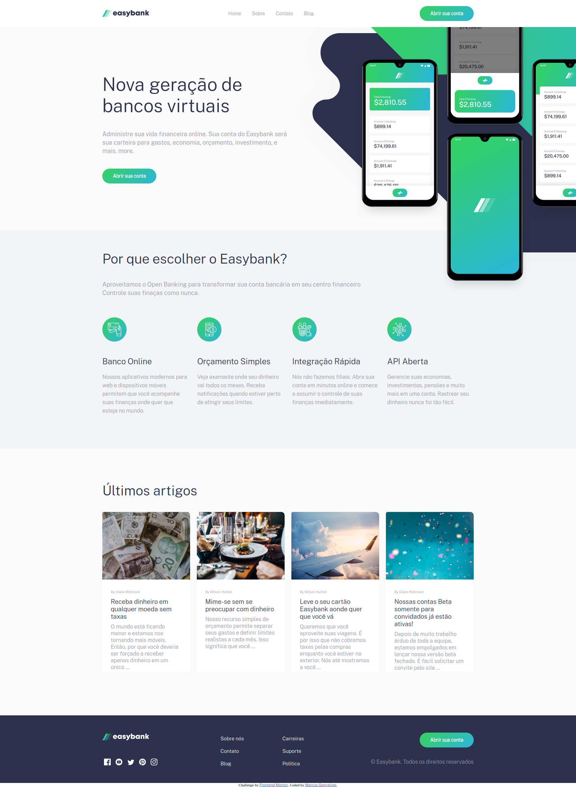

# Easy Bank
Essa landing page foi um dos desafios propostos pelo site <a href="https://www.frontendmentor.io/">Front Mentor</a>. 🚀   
No site eles fornecem as imagens do site e uma foto de como a interface deve ficar, e aí, o resto é com você. 🯠 
Eu escolhi fazer o desafio do <a href="https://www.frontendmentor.io/challenges/easybank-landing-page-WaUhkoDN">Easy Bank</a>.
 
### Resultado 🏆:
</img>
### Imagem usada como referência:
</img>
 
### Ficou parecido? 😃
Obs: No meu projeto eu traduzi tudo para português.
